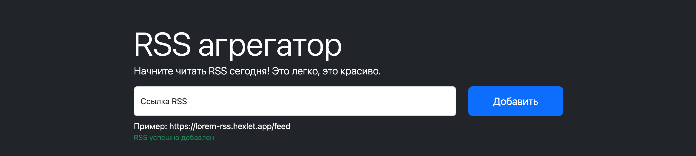

### Hexlet tests and build status:

### Deployed in [Vercel](https://frontend-project-11-drab-eight.vercel.app)

### Description

Rss-reader is a web application that allows you to add RSS feeds. The application also allows you to view the content of each feed. Each feed has posts which are displayed on the main page. You can see preview of the posts in modal window.

### Install

## Clone repository
    git clone https://github.com/bobrov-site/frontend-project-11.git

## Install dependencies

    make install

## Run server
    make serve

## Server localhost:3000
    http://localhost:3000

## Build project

    make build

### For test you can use next RSS resources:
[Lorem Hexlet](https://lorem-rss.hexlet.app/feed)

[Lessons Hexlet](https://ru.hexlet.io/lessons.rss)